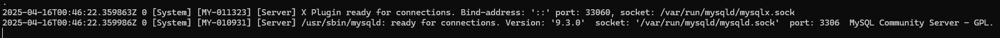
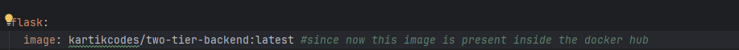

# Docker
What is docker?
Imagine you are a person who wants to ship some application to a client. You put in a lot of efforts to build that 
application and deployed it on your local machine. It works great. However, after shipping it to your client you get to 
know that the application didn't work on his/her machine. What would you do?

This is where docker comes in. It uses a docker engine to containerize your application. Basically, docker would create
a virtual environment for your application and build an image out of it. Now, you would ship that image to the client 
instead of your raw application. Now, the client could easily run your application since now he is running an image that
already has all the necessary dependencies required for your application to run.

## Docker Architecture
1. **Docker Engine** : Also known as docker application container engine on top of which all the docker containers run.
2. **Docker Daemon** : Or docker d is a service that manages your containers with shared memory. It also has a container d(a project written in Golang)
3. **Docker CLI** : Command Line Interface which helps to run all the docker related commands. Basically, all the commands you write in cli are pushed to docker d which in turn asks the container d to execute the specific operation.
4. **Docker Client/Desktop** : Connects the apis to help visualize all the docker containers in a UI. Helps in communicating with the docker engine.

## Installing Docker
1. You can download the docker desktop to run it locally on your machine. 
2. In order to do that, just download the docker desktop. You'll see a terminal option in the bottom right corner of the application. Open it and you are good to go.
3. You can also use the aws ec2 instance to run it on aws. 
4. Create an ec2 instance and follow along to run that instance inside your shell.
5. ```sudo apt-get install docker.io``` to download it on your aws instance -- This will give you access to docker engine, daemon and cli
6. Restrict permissions for your key: ```chmod 400 ~/<name of your instance key>.pem```
7. Connect to your instance using its public dns: ```ssh -i "<name of your instance key>.pem" ubuntu@<your dns>```
8. Try running ```docker ps```
9. If permission denied for the user, modify user using ```sudo usermod -aG docker $USER```
10. If the error persists, run ```newgrp docker```
11. Repeat step 5.

## Docker image
1. Think of an image like a small chit you carry to your exam center.
2. Using that chit you can write your whole answer sheet right?
3. So basically, in terms of docker the 'chit' is the 'docker image'.
4. And the answer copy you write becomes the 'docker container'
5. Just like the chit given to any person can help him/her pass exams, similarly using this docker image you can create containers anywhere and everywhere.
6. But, how to create a docker image? This is done by writing a **dockerfile**
7. In simple terms, an image is a blueprint that contains steps to run an application.
8. Dockerfile is a list of instructions that helps in creating an image.

### Building and Running an image
1. Create a dockerfile and list down all the instructions to build an image
2. Now, build an image
3. Run that image.
4. Is it necessary to write a dockerfile everytime to run a container?
5. Absolutely not, you can also run prebuilt images to run a container.
   1. ```docker pull hello-world``` will help you in pulling(downloading) an already existing image inside a docker hub(think of it like a shop for docker images)
   2. You should see something like: 
      1. 
   3. Run ```docker images```.
   4. You should see something like: 
      1. 
   5. Like this, without writing a dockerfile you were able to create an image.
   6. Next step is to run the image.
   7. Run ```docker run <image-name>```
   8. You should see something like: 
      1. 
   9. You can also try running other images by pulling from dockerhub. Some examples include ```docker pull mysql```
   10. In order to run an image in [detached](#detached-mode) mode, the run command should look like ```docker run -d <image-name>```

**Note:** It's not necessary to build an image that already exists on docker hub. You can directly run the hello-world image by running ```docker run hello-world```.
          Docker will first pull the image from the dockerhub and then run the container. 
          You should see something like:
1. 

### Detached Mode
When you run a container in detached mode, it does not block your screen. For instance below are the commands to run an image in 2 ways:

1. ```docker run hello-world``` : Runs without detached mode and hence opens up the log screen as soon as you run the command.
2. ```docker run -d hello-world``` : Gives you a container id which you can use to view the logs willingly whenever needed. Basically will run the container in the background.

## Writing a Dockerfile
1. Before moving on to write a dockerfile, we need to understand that the image of our application should include the source code, the dependencies and the libraries used and everything related to the image.
2. This image becomes a box that includes everything related to the application and this is what becomes a container that runs for our application.
3. Now, building a custom image requires us to write a Dockerfile and here, writing a dockerfile involves a set of instructions to build a docker image.
4. Just like for you cooking Maggi involves a set of steps like getting a container -> boiling water -> putting maggi and masala -> cook. Finally you'll be having cooked maggi.
5. Similarly, by following a set of instructions in a dockerfile it'll help you in building an image of your application.
6. I have added a sample dockerfile for reference.

#### CMD VS ENTRYPOINT
The CMD and ENTRYPOINT commands serve different purposes and have distinct behaviors.

| CMD                                       |                ENTRYPOINT                 |
|:------------------------------------------|:-----------------------------------------:|
| sets default parameters for the container | sets primary parameters for the container |
| can be overridden                         |           cannot be overridden            |
| used for default parameters                         |           used for the main executable command            |

### Building a custom image
Run : ```docker build -t <image-name> .``` 
1. -t tag is used to provide an image name
2. **'.'** is used as a context. This means Docker will look for the Dockerfile in the current directory where the command is executed.

### Running a custom image
Run: ```docker run <image-name>```
1. If your application is a web application or a server, it requires a port to run.
2. You can also give the port on which you want your application to run using **-p** tag.
3. **-p** stands for publish. You need to publish the port.
4. Let's say your application(host) runs on PORT 8080, and you also want the container to run on PORT 8080 hence you need to bind these ports using -p 8080(host):8080(container).
5. In order to view logs for your container, run ```docker logs <container id>```.
6. You can also view logs in real time, run ```docker logs -f <container id>``` OR ```docker attach <container id>```

### Important commands
1. _Stop a running container_ : ```docker stop <container id>```
2. _Start a stopped container_ : ```docker start <container id>```
3. _Restart a running container_ : ```docker restart <container id>```
4. _Remove all the unnecessary containers_: ```docker system prune```
5. _Monitoring+: ```nohup docker attach <container id> &```

**Important** : 
Any code changes you make after creating a container will not be reflected inside the image and hence won't be visible when you run an old container or even restart/beat the shit out of it, it just won't work.
Hence, making code changes require you to build a new image(no command change) and then run that new image(no command change).

### Example of a MySQL database
Run : ```docker run -e MYSQL_ROOT_PASSWORD=<your preferred password> mysql```
1. **-e** denotes environment.
2. Mysql requires MYSQL_ROOT_PASSWORD to be passed as an environment and hence you can put it in the run command itself.
3. You should see something like: 

4. Now, if you want to be able to execute commands inside the above container like mysql, you need to get a terminal for the same. Follow the below command:
   1. ```docker exec -it <container id> bash```
   2. **exec** stands for execute.
   3. **-it** stands for interactive terminal
   4. **bash** is basically used to start a bash shell inside your container.
   5. After executing above command, you should see something like:
   6. 

## Docker Networking
Imagine you have 2 docker containers running on your machine. One container is of your Java application and another one is of a mysql database. Both are running in an isolated manner.
As of now, they can't talk to each other. Hence, if you want to connect your application to the database it won't be that easy. Hence, the concept of docker networking comes into picture.
If somehow, we are able to connect the java container to the database container we are good to go right? We need to build a network between both the containers.

There are mainly 4 types of docker networks:
1. Host
2. Bridge(default)
3. User defined Bridge
4. None

######  MACVLAN, IPVLAN, Overlay are also there but are outdated

* If you want to see the networks present inside docker, run : ```docker network ls```
* If you want to create one : ```docker network create <network name of your choice> -d bridge```
* **-d** stands for driver.
* **Bridge** is a driver.

### Exercise
1. Let's create a network between two docker containers.
2. For this, we will be connecting an application running on docker with a database running on docker.
3. In order to connect them, we need to create a network between them right?
4. Run the command: ```docker network create <your preferred name of the network> <network type(you can use one of the above 4 networks mentioned)>```
5. 
6. Now run the mysql container(you have to give the network created above to the run command): [Go to the command](#example-of-a-mysql-database)
7. Similarly, you also need to run your application inside a docker container.
8. Important: If you don't have an application that simply connects to the database then create one. If you want a tutorial on the same you can connect with me on: [Twitter](https://x.com/devwithkartik)
9. Once you have your application in place, make sure to run the container by giving the network similar to the mysql container. 
10. A run command with the network given looks like : ```docker run -d --network <network name> <image name>```
11. That's it. Your two containers are now connected. Congrats.

Connect with me on twitter or linkedin for any doubts:
[Twitter](https://x.com/devwithkartik)
[Linkedin](https://www.linkedin.com/in/kartikey-srivastava-bb913423a/)

**IMPORTANT**
1. In case, your database container crashes, deleted by mistake you will lose all your data even if you restart your container within the same network.
2. If you want to try this on your local project, remove the mysql container and restart it. You'll lose all data.
3. This can be dangerous right? Losing all your data? Well, we have a solution for that.
4. This brings us to a new topic: _Docker Volumes and Storage_

## Docker Volumes and Storage
If we bind the container with the host, we could preserve the data.
Run: ```docker volume ls``` 
1. This will give a list of the existing volumes present. However, we are going to create a new volume.
2. Create a new volume: ```docker volume create <preferred volume name>```
3. Now, this volume will be created on your host. You can view the path using ```docker inspect <volume name>```
4. You should see something like:
5. 
6. The path you see in the **Mountpoint** is where your volume is created.
7. Now, we need to bind our container with the above path(where volume resides).
8. Let's remove the old mysql container since we will run a new container with the volume path bound to it.
9. Run: ```docker run -d --name mysql --network two-tier -v mysql-data:/var/lib/mysql -e MYSQL_ROOT_PASSWORD=root -e MYSQL_DATABASE=devops mysql```
   #### Understanding the above command: 
   1.  **--name mysql** -- host name
   2. **--network two-tier** -- our custom network used to connect the application with the database.
   3. **-v mysql-data:/var/lib/mysql** -- Binding our custom created volume with the mysql data. The mysql data resides in **/var/lib/mysql** path.
   4. **-e MYSQL_ROOT_PASSWORD=root -e MYSQL_DATABASE=devops** -- the environment.
   5. **mysql** -- the image name. 
   6. **Note:** -- _You don't need to build any image of mysql. It'll be generated by docker itself by pulling it from the docker hub_
10. That's it. You have successfully preserved your data.
11. In order to test the same, restart the application's container. 
12. Now, even if the mysql server crashes, you won't be losing any data. 
13. There's another way to preserve your data by creating your own path and storing the mysql data there. 
14. Just replace ```mysql-data``` in the docker run command above by the path of your own choice and you'll be good to go.

## Docker Compose
Till now, we have been doing a lot of manual work and running a lot of commands manually. Docker compose is a tool that helps in automating things for us. Let's understand how it works.
1. This is yet another configuration file which is a **yml** or **yaml** file.
2. This file helps in creating more than 1 container simultaneously.
3. I have added a sample docker compose file in this project. 
4. Install docker compose: ```sudo apt-get install docker-compose-v2```
5. Now, inside the project's directory create a docker compose file.
6. Now, run: ```docker compose up```
7. That's it, docker compose will create 2 containers for you with the exact same configurations.
8. There's no need to create a dockerfile now.
9. **NOTE**: You must have noticed that I have added additional health checks in the file. This is because if the application started without the mysql being up, it'll break eventually.
10. The docker compose file in this project depicts a flask app connected with mysql server.
11. To stop and remove all containers, run: ```docker compose down```

## Docker Registry
1. Docker registry is a centralized system to store all our docker images that contain all the packages required to run our application. 
2. This could also be hosted by Docker hub.
3. So, if you want to push your image to docker hub, docker registry comes into picture.
4. First step is to give a tag to your image.
5. Run: ```docker image tag <your old image name> <docker username>/<new image name>```
   1. _**docker image tag two-tier-flask-app-flask:latest kartikcodes/two-tier-backend:latest**_
6. Now, run: ```docker push kartikcodes/two-tier-backend:latest```
7. This way, you can push your image present locally to your docker hub.
8. **Note**: You should be able to login to your docker account. Run: ```docker login``` to verify if you are logged in.
9. Now, your docker compose file can be modified as well.
10. OLD: 
11. NEW: 

## Multi Stage docker build
1. The current repository has a sample Main class and a dockerfile.
2. You can clone this project.
3. Run: ```docker build -t sample-project .```
4. Observe the built image with the ```docker images```.
5. Take a look at the image size(without multi-stage):
6. That's a big image, approx: 470 mb.
7. Think of it this way: you need a hammer to build a house, but once it's built, you don't need to carry the hammer around everywhere you go.
8. Similarly, the java compiler is essential for building the application, but it's unnecessary baggage once the app is up and running. 
9. Ideally, you want a minimal docker image that only contains the Java runtime adn nothing else.
10. This also helps in avoiding any malicious attacks since there are fewer vulnerabilities.
11. This brings us to the concept of _Multi Stage Docker Build_
12. It involves two docker images working together to selectively copy only the essential parts of your application from one image to the other.
13. Take a look at the image size using multi-stage docker build : 
14. As you can see, using multi-stage can help us reduce the size of the image to an extent. In some cases, you can exponentially decrease the size of the image using multi-stage docker build.
15. A sample dockerfile following multi-stage docker build is added in the repo.

